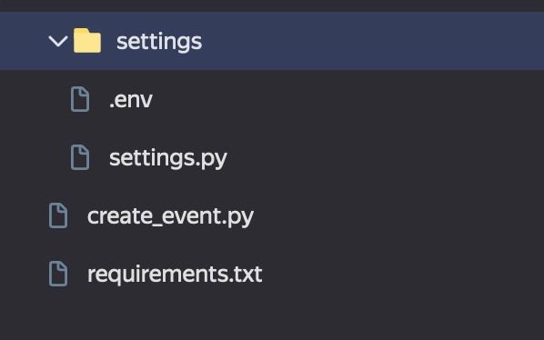
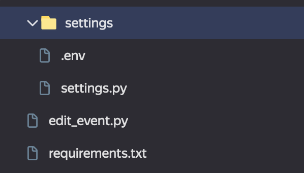
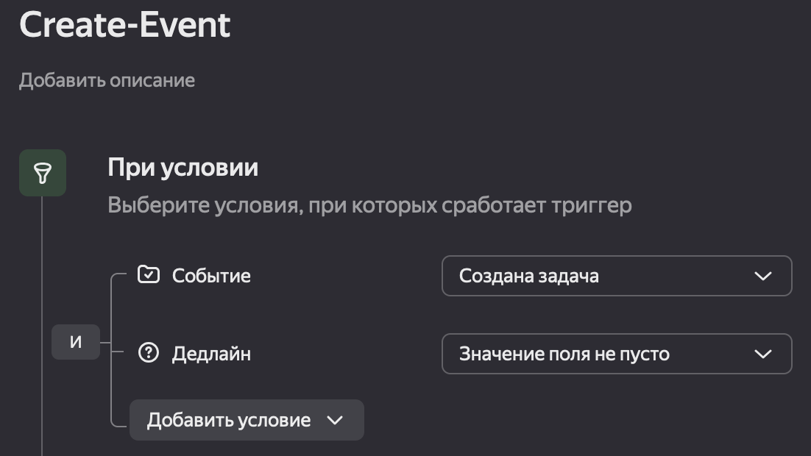

# Python_CalDav_examples

## Описание

Скрипт является **примером** создания и редактирования событий в календаре через протоколо CalDav и может быть применен для автоматизации Яндекс Трекера:
создание дедлайна по задаче в календаре.

## Подготовка окружения

Для запуска скрипта необходимо:

- Создать две функции в сервисе Cloud Functions. Подробнее тут: https://yandex.cloud/ru/docs/functions
- Для каждой функции используйте соответствующий архив: create_event и edit_event
- Заполните данные для запуска функций в файле sample.env, после чего переименуйте его в .env:

```
CALDAV_URL=https://caldav.yandex.ru
CALDAV_USERNAME=user@yandex.ru
CALDAV_PASSWORD=password
CALENDAR_URL=calendars/user%40yandex.ru/events-00000000/
ORGANIZER=user@yandex.ru # Организатор встреч. Рекомендуется использовать обезличенную учетную запись,
на которую будет выдан токен
ORGHEADER=X-Cloud-Org-ID или X-Org-ID
ORGID=000
EVENT_URL_FIELD=000--eventURL # Идентификатор поля в Трекере, которое используется для записи ссылки на событие (дедлайн задачи)
OAUTH_TOKEN=y0_000 # Токен для доступа к Яндекс Трекеру
```
Функция create_event. Точка входа в Cloud Functions create_event.main:



Функция edit_event. Точка входа в Cloud Functions edit_event.main:



Настройки триггера в Трекере:



Тело http-запроса в триггере создания события:
```
{
"attendees": [{{issue.followers.email}},{{issue.assignee.email}}],
 "deadline": "{{issue.dueDate.iso8601}}",
 "summary": "{{issue.summary}}",
 "description": "{{issue.key}} - {{issue.description}}",
 "task_key": "{{issue.key}}"
}
```

Тело http-запроса в триггере изменения события:
```
{
"attendees": [{{issue.followers.email}}],
 "deadline": "{{issue.dueDate.iso8601}}",
 "event_url": "{{issue.local.eventURL}}",
 "task_key": "{{issue.key}}"
}
```
